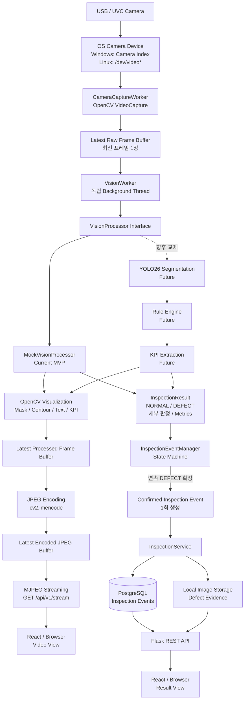
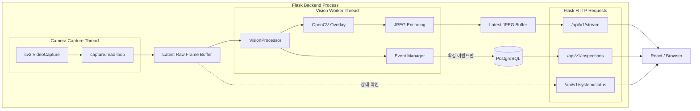
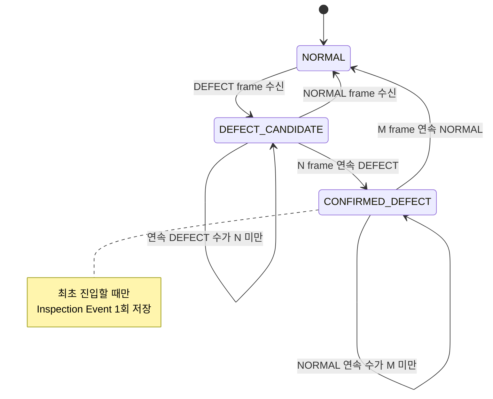
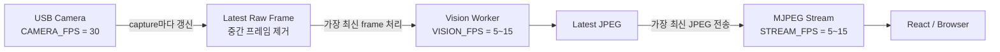
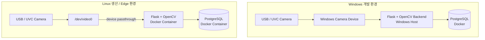

USB/UVC 카메라를 기준으로 수정한 전체 아키텍처입니다.



### 실행 컴포넌트 관계



### Event Manager 상태 머신



### FPS 분리 구조



### 배포 구조



최종 핵심 흐름은 다음과 같습니다.

```text
USB/UVC Camera
→ OpenCV Camera Worker
→ Latest Raw Frame
→ Vision Worker
→ YOLO/Rule Engine
→ Processed Frame + Inspection Result
├── JPEG → MJPEG → React
└── Event Manager → PostgreSQL → REST API → React
```