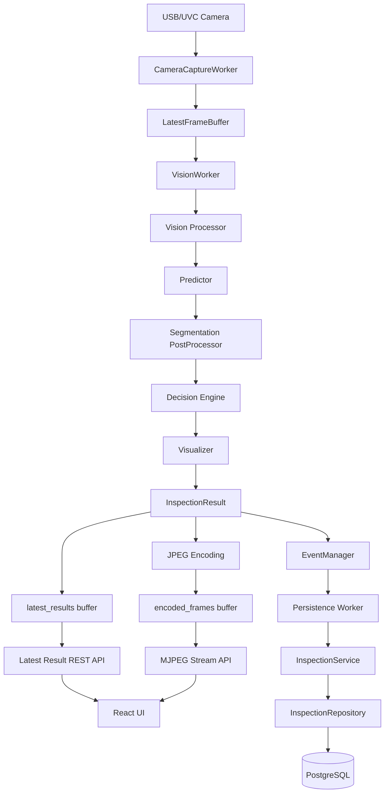
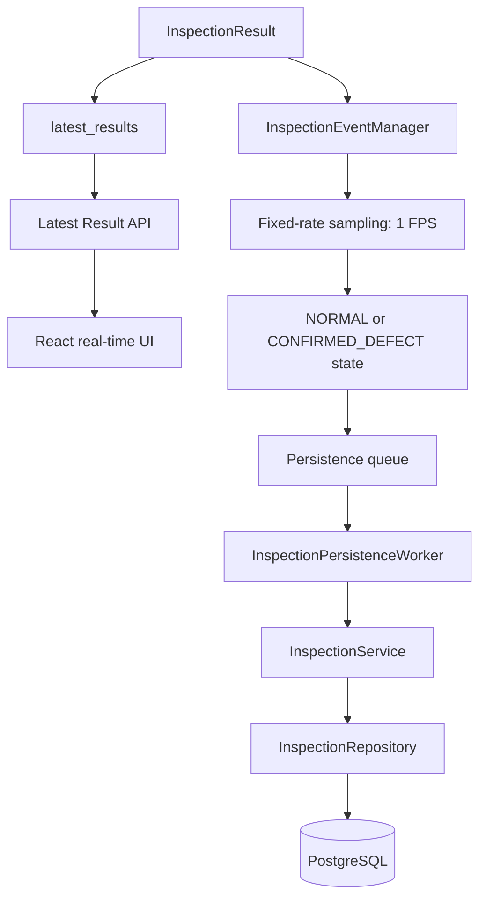
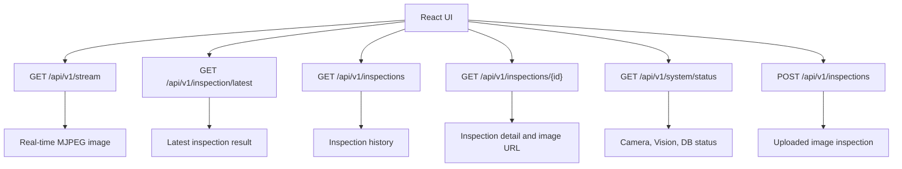

# Bolt Vision Inspection System

카메라 영상에서 볼트·너트·와셔·나사산을 segmentation 모델로 검출하고, 구성품·조립 순서·체결 상태를 판정하는 머신비전 검사 시스템입니다. Flask가 실시간 검사 결과와 MJPEG 영상을 제공하고 React UI에서 현재 상태와 저장된 검사 이력을 확인합니다.

## 주요 기능

- USB/UVC 카메라 프레임 캡처와 최신 프레임 버퍼링
- U-Net, YOLO segmentation, Mask R-CNN 중 선택한 모델로 부품 영역 검출
- 볼트/너트/와셔 수량, 조립 순서, 나사산 노출 비율, 너트-와셔 간격, 너트 기울기 측정
- 최신 검사 JSON, MJPEG 스트림, 시스템 상태 API 제공
- 설정된 주기로 검사 결과를 비동기 저장하고 PostgreSQL에서 이력 조회
- 카메라 없이도 JPG/PNG 파일을 업로드해 단건 검사
- Backend와 Frontend를 오직 동일 PC의 localhost에서 실행

## 기술 스택

| 영역 | 기술 |
|---|---|
| Backend | Python, Flask, Flask-SQLAlchemy |
| Vision | OpenCV, PyTorch, Torchvision, Ultralytics |
| Frontend | React 19, TypeScript, Vite, Tailwind CSS |
| Database | PostgreSQL 16 |
| Infra | Docker Compose |

## 로컬 실행 방법

기본 실행 경로는 `Browser → React(127.0.0.1:5174) → Flask(127.0.0.1:5000)`입니다. Backend과 Frontend는 `0.0.0.0`에 바인딩하지 않으며, PostgreSQL 포트도 호스트의 `127.0.0.1`에만 공개됩니다.

### 1. PostgreSQL

프로젝트 루트에서 DB 컨테이너를 실행합니다.

```powershell
cd C:\sungwon\vision_final_project
docker compose up -d db
```

최초 실행 또는 schema 변경 후 migration SQL을 적용합니다.

```powershell
Get-Content -Raw backend\migrations\001_create_inspections.sql |
  docker compose exec -T db psql -U vision -d vision_inspection
```

기본 개발 DB는 `vision_inspection`, 사용자와 비밀번호는 모두 `vision`, 호스트 포트는 `127.0.0.1:5432`입니다.

### 2. Backend

Windows PowerShell 기준입니다.

```powershell
cd C:\sungwon\vision_final_project

python -m venv .venv
.\.venv\Scripts\Activate.ps1
python -m pip install --upgrade pip
python -m pip install -r backend\requirements.txt

Copy-Item backend\.env.example backend\.env.local
python backend\run.py
```

`backend/.env.local`에서 카메라 인덱스와 사용할 Vision 모델을 환경에 맞게 조정합니다. 로컬 접속 설정은 다음과 같습니다.

```dotenv
FLASK_HOST=127.0.0.1
FLASK_PORT=5000
CORS_ALLOWED_ORIGINS=http://localhost:5174,http://127.0.0.1:5174
```

Backend: <http://127.0.0.1:5000>

### 3. Frontend

```powershell
cd C:\sungwon\vision_final_project\frontend
npm install
Copy-Item .env.example .env.local
npm run dev
```

Frontend: <http://127.0.0.1:5174>  
`localhost` 표기를 선호하면 <http://localhost:5174>로도 접속할 수 있습니다. `VITE_API_BASE_URL` 기본 예제는 `http://127.0.0.1:5000`입니다.

## 시스템 아키텍처



### Vision

`VISION_PROCESSOR` 환경변수로 `unet`, `yolo26`, `mask_rcnn`, `mock`을 선택합니다. 실제 segmentation 모델은 U-Net(ResNet18 encoder), YOLO segmentation, Mask R-CNN이며, 모두 공통 `InspectionDecisionEngine`과 `InspectionVisualizer`를 사용합니다.

```mermaid
flowchart LR
    Frame[Camera Frame] --> Predictor[Model Predictor]
    Predictor --> Segmentation[Segmentation Prediction]
    Segmentation --> PostProcessor[Model PostProcessor]
    PostProcessor --> Instances[DetectedInstance list]
    Instances --> Decision[InspectionDecisionEngine]
    Decision --> Result[InspectionResult]
    Result --> Visualizer[InspectionVisualizer]
    Visualizer --> Processed[Processed Frame]
```



Decision Engine은 검출된 `bolt`, `washer`, `thread`를 기준으로 다음을 판정하거나 측정합니다.

- 볼트 머리/너트와 와셔의 수량 및 누락·과다
- `bolt → washer → washer → bolt` 조립 순서
- 나사산 노출 비율과 설정 임계값
- 너트-와셔 간격과 너트 기울기
- `NORMAL`, `DEFECT`, `NOT_EVALUATED` 상태와 실패 코드

### EventManager

실시간 화면은 모든 처리 결과가 들어가는 `latest_results`를 조회합니다. EventManager는 API를 담당하지 않고 DB에 저장할 결과를 고정 주기로 샘플링해 persistence queue로 넘깁니다.

현재 `backend/.env.local`의 `EVENT_SAMPLE_FPS=1.0`이므로 최대 초당 1건을 저장 경로로 보냅니다. 현재 구현은 sampled `NORMAL`/`DEFECT` 결과를 모두 저장하며, `DefectSignature` 유사도 비교는 EventManager 흐름에 연결되어 있지 않습니다.



### Frontend

Frontend는 `src/services/inspectionApi.ts`를 통해 Flask의 `/api/v1` API를 호출합니다.



## API

| Method | Endpoint | 설명 |
|---|---|---|
| GET | `/` | `/stream-test`로 redirect |
| GET | `/favicon.ico` | 빈 `204` 응답 |
| GET | `/stream-test` | Backend MJPEG 테스트 화면 |
| GET | `/api/v1/health` | DB query 없이 Vision 모델 load 상태 확인 |
| GET | `/api/v1/stream` | 실시간 Vision MJPEG 스트림 |
| GET | `/api/v1/inspection/latest` | 메모리 버퍼의 최신 검사 결과. 아직 결과가 없으면 `204` |
| POST | `/api/v1/inspections` | JPG/PNG 파일 단건 검사 및 저장 |
| GET | `/api/v1/inspections?page=0&size=20` | 저장된 검사 이력 페이징 조회 |
| GET | `/api/v1/inspections/{id}` | 검사 상세 정보 |
| DELETE | `/api/v1/inspections/{id}` | 검사 DB record와 연결된 evidence image 삭제 |
| GET | `/api/v1/inspections/{id}/image` | 저장된 검사 이미지 |
| GET | `/api/v1/system/status` | Camera, Vision Worker, Persistence Worker, 모델, DB 상태 |

`GET /api/v1/inspection/latest` 응답 예시입니다. 최상위 필드는 `InspectionResult.to_live_dict()`에서 반환하는 값만 사용했습니다.

```json
{
  "inspectionTime": "2026-09-30T10:15:30.123000+00:00",
  "overallResult": "DEFECT",
  "componentResult": "NORMAL",
  "assemblySequenceResult": "NORMAL",
  "fasteningQualityResult": "DEFECT",
  "missingComponentResult": "NORMAL",
  "alignmentResult": "NORMAL",
  "fasteningResult": "DEFECT",
  "metrics": {
    "modelType": "u-net-resnet18",
    "detectedInstanceCount": 5,
    "inferenceTimeMs": 63.42,
    "detectedCounts": {
      "bolt": 2,
      "thread": 1,
      "washer": 2
    },
    "threadExposureRatio": 1.2,
    "threadExposureThreshold": 1.3,
    "nutWasherGapRatio": 0.04,
    "nutTiltDeg": 2.1,
    "failureReasons": ["LOOSE"],
    "fasteningEvaluated": true,
    "detections": []
  }
}
```

## 프로젝트 구조

```text
vision_final_project/
├─ backend/                         # Flask Backend와 Vision runtime
│  ├─ app/
│  │  ├─ api/                    # REST API와 MJPEG route
│  │  ├─ camera/                 # Camera worker와 latest frame buffer
│  │  ├─ database/               # SQLAlchemy 초기화
│  │  ├─ inspection/             # EventManager, persistence worker, service
│  │  ├─ models/                 # Inspection DB model
│  │  ├─ repositories/           # Inspection repository
│  │  ├─ streaming/              # MJPEG generator
│  │  └─ vision/                 # 모델별 predictor/postprocessor와 판정·시각화
│  ├─ migrations/              # PostgreSQL 초기 schema
│  ├─ storage/defects/         # 저장된 검사 증거 이미지
│  ├─ tests/                   # Backend 회귀 테스트
│  ├─ .env.example
│  └─ run.py                   # Flask 실행 진입점
├─ frontend/                        # React + TypeScript + Vite UI
│  ├─ src/
│  │  ├─ components/             # 공통 UI와 MJPEG viewer
│  │  ├─ layouts/                # 앱 layout과 시스템 상태 조회
│  │  ├─ pages/                  # Dashboard, 실시간 검사, 이력, 설정
│  │  ├─ services/               # 실제 Flask API adapter
│  │  └─ types/                  # API response type
│  ├─ .env.example
│  ├─ package.json
│  └─ vite.config.ts
├─ output/                          # U-Net, YOLO, Mask R-CNN 모델 파일
├─ training/mask-rcnn/              # Mask R-CNN 학습·평가 코드
├─ colab/                           # 학습 notebook
├─ design/                          # UI wireframe과 mockup
├─ ppt/                             # 프로젝트 발표 자료
├─ compose.yaml                     # localhost 전용 PostgreSQL
└─ README.md
```
