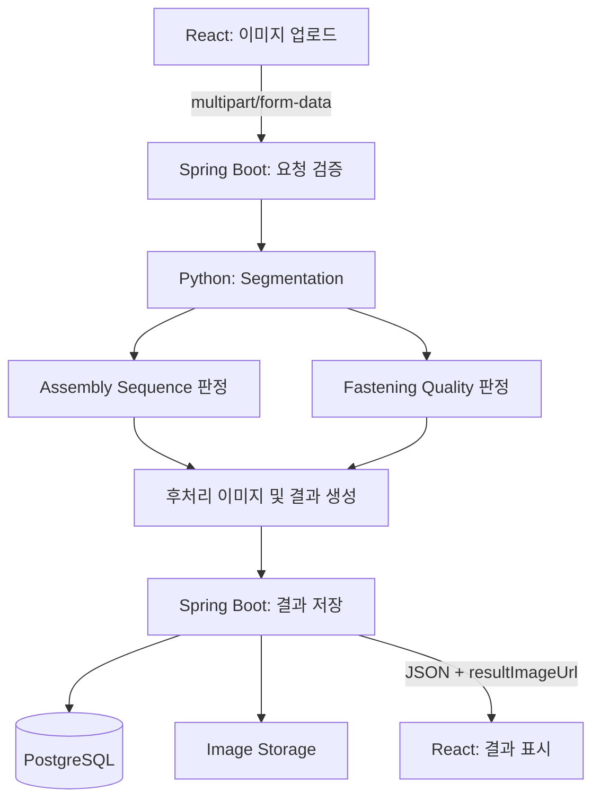

# Bolt-Nut-Washer Vision Inspection API

설계 상태: 초기 명세. API 서버와 모델은 아직 구현하지 않는다.

## 1. 목적과 책임

이미지 한 장을 받아 Segmentation 기반으로 볼트·와셔·너트 구성과 체결 외관을 검사하고, 두 판정 결과 및 후처리 이미지 URL을 반환한다.

- React: 이미지 업로드, 두 판정과 종합 결과 표시, 결과 이미지 및 이력 조회
- Spring Boot: 요청 검증, Python Vision 호출, 검사 결과 및 이미지 저장, 공개 API 응답
- Python Vision: Segmentation, 조립 구성/순서 판정, 체결 품질 판정, 후처리 이미지 생성
- PostgreSQL: 검사 메타데이터 및 이미지 저장 경로
- Image Storage: `storage/originals`, `storage/results`에 이미지 파일 저장



## 2. 공통 계약

- Base path: `/api/v1`
- JSON 응답: `application/json`, UTF-8
- 결과 enum: `NORMAL`, `DEFECT`
- 시간: ISO 8601 오프셋 포함 문자열. 예: `2026-09-22T10:30:21+09:00`
- ID: 양의 Long 정수
- 업로드는 이미지 한 장만 허용한다. 확장자뿐 아니라 실제 이미지 형식과 디코딩 가능 여부를 검증한다.
- 이미지 크기 상한은 구현 시 서버 설정과 함께 확정한다. 초과 요청은 413으로 반환한다.
- 선택 필드 `workOrderId`, `partModel`은 생략 가능하며 응답에서는 `null`로 표현한다. 품목 생략 시 서버 기본 검사 기준을 적용한다.
- 이미지 바이너리를 Base64로 JSON에 포함하지 않는다. `resultImageUrl`은 API 서버 기준 상대 URL이다.
- 프론트와 API 호스트가 다르면 프론트는 API origin과 상대 URL을 결합한다.
- 이미지와 메타데이터 저장까지 성공한 검사에 한해 성공 응답을 반환한다.

## 3. 판정 정의

### Assembly Sequence Inspection

`볼트 → 와셔 → 너트`의 기대 구성과 공간적 순서를 검사한다. 단일 완성 이미지에서 실제 조립 작업의 시간 순서를 복원하는 의미는 아니다. 검사 축, 촬영 방향, 기대 부품 수와 위치 관계는 품목별 기준으로 정의한다.

- NORMAL: 기대 부품과 배치 관계 충족
- DEFECT: 와셔 누락, 부품 누락, 기준과 다른 배치 등 확인된 불량

### Fastening Quality Inspection

너트 기울어짐, 와셔 안착 불량, 체결 위치 이상, 관측 가능한 간격 등 품목별 외관 기준을 검사한다. 각 측정값의 기준과 허용오차는 학습·검증 데이터로 확정한다. 중심 x,y만으로 간격을 측정하지 않고 마스크 경계와 필요한 단위 보정을 사용한다. 실제 토크는 이 API가 영상으로 직접 측정하는 값이 아니다.

### Overall Result

두 결과가 모두 NORMAL이면 NORMAL, 하나라도 DEFECT이면 DEFECT이다.

가림, 흐림, 모델 오류 등으로 판정할 수 없는 경우에는 임의로 NORMAL/DEFECT를 부여하지 않고 오류 응답을 반환한다. 명확한 부품 누락은 DEFECT이며, 단순 검출 실패와 구분한다. 두 검사 중 하나를 완료할 수 없으면 성공 검사로 저장하지 않는다.

## 4. 이미지 검사

### POST `/api/v1/inspections`

동기 검사 API. 요청 이미지에 대한 추론, 판정, 후처리 및 저장이 끝난 후 HTTP 200을 반환한다.

Content-Type: `multipart/form-data`

| 필드 | 타입 | 필수 | 설명 |
| --- | --- | --- | --- |
| image | File | O | JPG/JPEG 또는 PNG 한 장 |
| workOrderId | String | X | 작업지시 ID |
| partModel | String | X | 검사 기준을 선택할 품목 코드 |

예: `image=bolt_test_001.jpg`, `workOrderId=WO-CN7-001`, `partModel=CN7`

성공 응답(HTTP 200):

```json
{
  "inspectionId": 10532,
  "workOrderId": "WO-CN7-001",
  "partModel": "CN7",
  "assemblySequence": { "result": "NORMAL" },
  "fasteningQuality": { "result": "DEFECT" },
  "overallResult": "DEFECT",
  "resultImageUrl": "/api/v1/inspections/10532/image",
  "inspectedAt": "2026-09-22T10:30:21+09:00"
}
```

| 필드 | 타입 | 의미 |
| --- | --- | --- |
| inspectionId | Long | 검사 고유 ID |
| workOrderId | String 또는 null | 작업지시 ID |
| partModel | String 또는 null | 요청 품목 |
| assemblySequence.result | Enum | 구성/순서 판정 |
| fasteningQuality.result | Enum | 체결 품질 판정 |
| overallResult | Enum | 두 판정의 종합 결과 |
| resultImageUrl | String | 후처리 이미지 조회 URL |
| inspectedAt | DateTime | 검사 완료 시각 |

동일 이미지라도 POST를 다시 호출하면 별도 검사로 생성된다. 초기 버전에서는 자동 재시도로 인한 중복 생성에 주의하며, 멱등성 키는 추후 확장 사항이다.

## 5. 후처리 이미지 조회

### GET `/api/v1/inspections/{inspectionId}/image`

- HTTP 200, `Content-Type: image/jpeg`
- 응답 본문: JPEG 바이너리
- 정상 검사도 조회 가능한 결과 이미지를 생성한다. Segmentation 표시 또는 원본 기반 JPEG를 사용한다.
- 불량 검사에는 불량 영역, 측정선, 판정 문구 등을 표시한다.
- inspectionId로 저장된 파일을 조회하며, 사용자가 임의 파일 경로를 전달하지 않는다.
- 검사 또는 파일이 없으면 JSON 오류를 반환한다.

## 6. 검사 이력 조회

### GET `/api/v1/inspections`

| Query | 타입 | 기본값 | 설명 |
| --- | --- | --- | --- |
| result | Enum | 미지정 | overallResult 필터 |
| partModel | String | 미지정 | 품목 코드 일치 필터 |
| page | Integer | 0 | 0부터 시작, 0 이상 |
| size | Integer | 20 | 페이지 크기, 1~100 |

정렬: `inspectedAt DESC, inspectionId DESC`. 결과가 없거나 범위를 벗어난 페이지는 빈 content와 HTTP 200을 반환한다. totalElements는 필터 적용 후 전체 건수이다.

HTTP 200:

```json
{
  "content": [
    {
      "inspectionId": 10532,
      "workOrderId": "WO-CN7-001",
      "partModel": "CN7",
      "assemblySequence": { "result": "NORMAL" },
      "fasteningQuality": { "result": "DEFECT" },
      "overallResult": "DEFECT",
      "resultImageUrl": "/api/v1/inspections/10532/image",
      "inspectedAt": "2026-09-22T10:30:21+09:00"
    }
  ],
  "page": 0,
  "size": 20,
  "totalElements": 1
}
```

목록·생성·상세에서 두 판정의 객체 형식을 동일하게 유지한다.

## 7. 검사 상세 조회

### GET `/api/v1/inspections/{inspectionId}`

HTTP 200 응답은 4절의 검사 생성 응답과 동일한 구조를 사용한다. 해당 검사가 없으면 HTTP 404와 INSPECTION_NOT_FOUND를 반환한다.

## 8. 공통 오류

```json
{
  "code": "VISION_INFERENCE_FAILED",
  "message": "이미지 검사 중 오류가 발생했습니다."
}
```

| HTTP | Code | 설명 |
| --- | --- | --- |
| 400 | EMPTY_IMAGE | 이미지 누락 또는 빈 파일 |
| 400 | INVALID_IMAGE | 지원하지 않는 이미지, 손상 이미지 또는 여러 이미지 |
| 400 | INVALID_PARAMETER | 잘못된 enum, ID, 페이지 또는 품목 코드 |
| 404 | INSPECTION_NOT_FOUND | 검사 결과 없음 |
| 404 | RESULT_IMAGE_NOT_FOUND | 검사 결과 이미지 없음 |
| 413 | IMAGE_TOO_LARGE | 업로드 크기 상한 초과 |
| 415 | UNSUPPORTED_MEDIA_TYPE | 요청 Content-Type이 multipart/form-data가 아님 |
| 422 | INSPECTION_UNDETERMINABLE | 흐림/가림 등으로 두 판정 완료 불가 |
| 500 | VISION_INFERENCE_FAILED | 모델 추론 실패 |
| 500 | IMAGE_PROCESSING_FAILED | 후처리 실패 |
| 500 | INSPECTION_SAVE_FAILED | 결과 또는 이미지 저장 실패 |
| 503 | VISION_UNAVAILABLE | Vision 서비스 연결 불가 |
| 504 | VISION_TIMEOUT | Vision 응답 시간 초과 |

서버 경로와 스택 추적은 오류 응답에 포함하지 않는다. 오류 기록은 정상/불량 검사 통계에 포함하지 않는다.

## 9. API 요약

| Method | Endpoint | 설명 |
| --- | --- | --- |
| POST | /api/v1/inspections | 이미지 한 장 검사 |
| GET | /api/v1/inspections | 검사 이력 |
| GET | /api/v1/inspections/{inspectionId} | 검사 상세 |
| GET | /api/v1/inspections/{inspectionId}/image | 후처리 이미지 |

## 10. 내부 Vision 인터페이스와 확장

내부 Python 호출의 전송 프로토콜과 엔드포인트는 구현 단계에서 확정한다. 공개 API와 분리하며, 입력은 이미지와 적용 검사 기준, 출력은 두 판정 객체와 후처리 이미지이다. Python은 모델 추론과 두 판정을 담당하고 Spring Boot는 종합 판정 규칙의 일관성을 확인한다.

DB에는 원본/후처리 이미지 경로와 검사 결과를 저장한다. 재현성을 위해 적용 모델 버전과 검사 기준 버전도 저장 대상으로 설계한다.

향후 두 판정 객체에 defectType, confidence, 측정값 등을 선택 필드로 추가할 수 있다. 현재 버전에서 이 필드를 필수로 요구하지 않는다.
