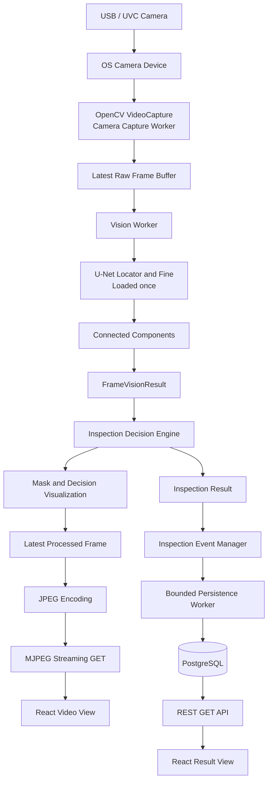
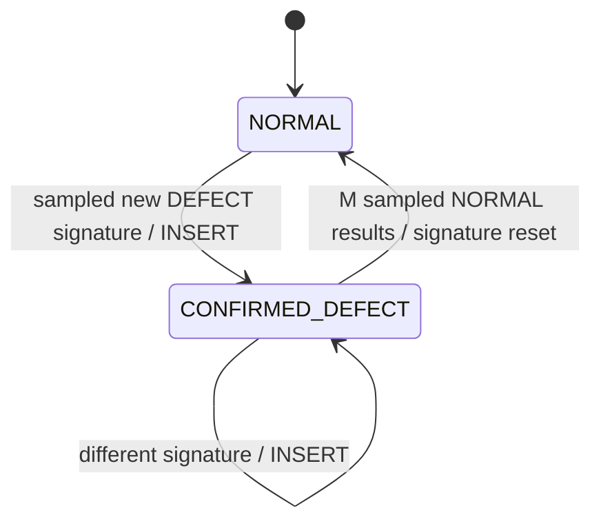

# Architecture

## Scope

This application runs trained locator/fine U-Net segmentation models for real-time Bolt/Washer/Thread segmentation. YOLO26 and Mask R-CNN adapters remain selectable for model comparison. PLC integration and MES functions remain outside the current scope.

## System flow



The media and data paths separate after vision processing:

- Media: processed frame → JPEG → MJPEG → browser.
- Data: inspection result → event manager → PostgreSQL → REST API → browser.

The stream endpoint only reads the latest encoded JPEG buffer. It never opens the camera, runs vision inference, evaluates rules, or encodes another JPEG. Therefore, an additional browser does not create another capture or inference worker.

## Runtime components

### Camera capture worker

One background worker owns `cv2.VideoCapture`. It continuously reads the USB/UVC camera exposed by the operating system and replaces the value in the raw latest-frame buffer. `CAMERA_INDEX` and capture dimensions/FPS come from configuration rather than source code.

Only this worker opens and releases the camera. On shutdown, application lifecycle handling stops the worker and releases `VideoCapture`.

### Latest-frame buffers

The raw and processed buffers each retain one frame plus metadata such as sequence number and capture time. Access is protected by synchronization primitives, and readers copy or otherwise safely snapshot shared frame data.

This is intentional backpressure behavior: when a consumer is slower than the producer, intermediate frames are dropped instead of accumulating in an unbounded queue. For a live operator view, lower latency is more valuable than processing stale frames.

A queue is still appropriate for data that must never be skipped, such as a PLC-triggered inspection cycle. That future path should carry small event records or selected evidence frames, not every camera frame.

### Vision worker and processor boundary

The vision worker wakes at `VISION_FPS`, reads the newest raw frame, and passes it to the configured processor. `VISION_PROCESSOR=unet` loads `output/u-net/locator/best.pt` and `output/u-net/fine/best.pt` once. `VISION_PROCESSOR=yolo26` and `VISION_PROCESSOR=mask_rcnn` remain selectable. All processors return the same internal contracts and reuse the same decision, visualization, JPEG, MJPEG, event, and API paths.

```text
InspectionResult
├── overallResult
├── missingComponentResult
├── alignmentResult
├── fasteningResult
├── metrics
└── processedFrame
```

The OpenCV overlay is applied before JPEG encoding:

```text
Raw frame → processor → rule result → OpenCV overlay → JPEG → MJPEG
```

Encoded MJPEG bytes are never used as the input to computer-vision processing.

The structured result contains class, confidence, bounding box, binary mask, largest contour, center, and pixel area for every accepted instance. Bolt and thread/nut masks are blue; washer masks are yellow. The current Decision Engine evaluates assembly sequence and fastening quality; unsupported checks such as alignment remain `NOT_EVALUATED`.

## Independent frame rates

Capture, inference, and display rates serve different responsibilities and are independently configurable.

| Stage | Configuration | Typical MVP value | Behavior |
| --- | --- | ---: | --- |
| Camera capture | `CAMERA_FPS` | 30 FPS | Samples the physical camera as frequently as practical. |
| Vision processing | `VISION_FPS` | 5–15 FPS | Processes the newest raw frame; skips older frames. |
| Event evaluation | `EVENT_SAMPLE_FPS` | 1 FPS | Compares sampled defect signatures before persistence. |
| Browser display | `STREAM_FPS` | 5–15 FPS | Sends the newest JPEG without causing inference. |

Reducing stream FPS, resolution, or `JPEG_QUALITY` directly reduces encoding, network, and browser load. A shared latest JPEG should be reused across clients where possible so that connecting another browser does not repeat `cv2.imencode` for the same processed frame.

## Inspection-event state machine

Frame classification and event persistence have different responsibilities. The Rule Engine classifies one observation; the Event Manager decides when observations represent one durable inspection event.



A sampled defect is compared with the last persisted `DefectSignature`. Equal categorical data and geometry within tolerance are dropped. A changed signature is enqueued even without an intermediate NORMAL result. Sustained sampled NORMAL results clear the signature so the same defect can be stored in a new inspection cycle. The bounded persistence worker remains responsible for evidence-image and PostgreSQL I/O.
| State transition | One write while a defect remains visible | Requires a reliable reset boundary |
| Object tracking | Associates observations with a physical item | More compute and tuning; occlusion/ID switches are possible |
| PLC/photo-sensor cycle | Strong production-cycle boundary | Requires hardware integration and signal reliability |

For a single fixed ROI and one product at a time, the state machine is a realistic MVP. The next production step should add a `cycle_id` from object tracking or a PLC/photo sensor and enforce uniqueness at the database boundary. For multiple simultaneous products, use one state machine per track/ROI rather than one global state.

## MJPEG design and limits

MJPEG is appropriate for this MVP because browsers can render it with a normal `` element and the server implementation remains small. The stream allows frame drops and prioritizes current content over delivery of every frame.

Operational controls:

- Lower `STREAM_FPS` before lowering capture FPS.
- Use a moderate `JPEG_QUALITY` such as 70–85.
- Configure camera resolution to the minimum that still supports later inspection accuracy.
- Encode after overlay, and avoid encoding once per connected client.
- Stop producing to a disconnected response immediately.

MJPEG has material scaling limits. Every frame is an independent JPEG, bandwidth increases with client and camera count, and compression is less efficient than H.264/WebRTC. If the system grows to many cameras or many viewers, move the display path to a dedicated video protocol or gateway while keeping inspection data on REST/SSE/WebSocket. Do not introduce that complexity for the current single-camera MVP.

## API interaction model

The MVP uses:

- MJPEG streaming GET for video.
- REST GET for latest result, history, detail, and evidence image.
- Modest client polling for the latest inspection result.

SSE or WebSocket can later push newly confirmed inspection events. They are not required for the current scope and do not replace the MJPEG video path.

## Process and resource lifecycle

Startup order:

1. Load and validate configuration.
2. Initialize database access.
3. Start camera capture.
4. Start the vision worker.
5. Serve Flask endpoints.

Shutdown reverses ownership: stop workers, wake blocked conditions, join threads with a bounded timeout, release `VideoCapture`, and dispose database resources. Request handlers do not own these long-lived resources.

## Deployment

The USB/UVC or DroidCam virtual camera is opened by the Flask backend running directly on the Windows host. Docker Compose is used only for PostgreSQL.

