# backend/app 폴더 역할

이 문서는 `backend/app`의 실제 코드와 import 관계를 기준으로 각 패키지의 책임을 설명한다. 핵심 원칙은 카메라 수집, AI 추론, 영상 스트리밍, 검사 이벤트 저장, REST 조회를 서로 다른 책임으로 분리하는 것이다.

## 전체 구조

```text
backend/app/
├── api/            HTTP endpoint와 응답 생성
├── camera/         카메라 소유권과 최신 프레임 버퍼
├── database/       SQLAlchemy 인스턴스와 DB 연결 기반
├── inspection/     프레임 판정을 검사 이벤트로 변환하고 저장
├── models/         PostgreSQL에 저장되는 ORM 모델
├── repositories/   DB 조회·저장 연산
├── streaming/      공유 JPEG를 MJPEG 응답으로 전송
├── vision/         Mask R-CNN 추론·후처리·시각화·worker
├── config.py       환경변수와 실행 설정
├── lifecycle.py    장기 실행 자원의 생성·시작·종료
└── __init__.py     Flask application factory
```

## 폴더별 역할

### `api/`

Flask Blueprint와 외부 HTTP 계약을 담당한다. 카메라를 직접 열거나 모델 추론을 실행하지 않는다.

| 파일 | 역할 |
| --- | --- |
| `stream.py` | `/api/v1/stream`, `/stream-test`, 루트 redirect |
| `inspections.py` | 최근 검사, 이력, 상세, 불량 이미지 GET API |
| `status.py` | 카메라, 모델, worker, DB 상태 조회 |
| `__init__.py` | Blueprint를 application factory에 노출 |

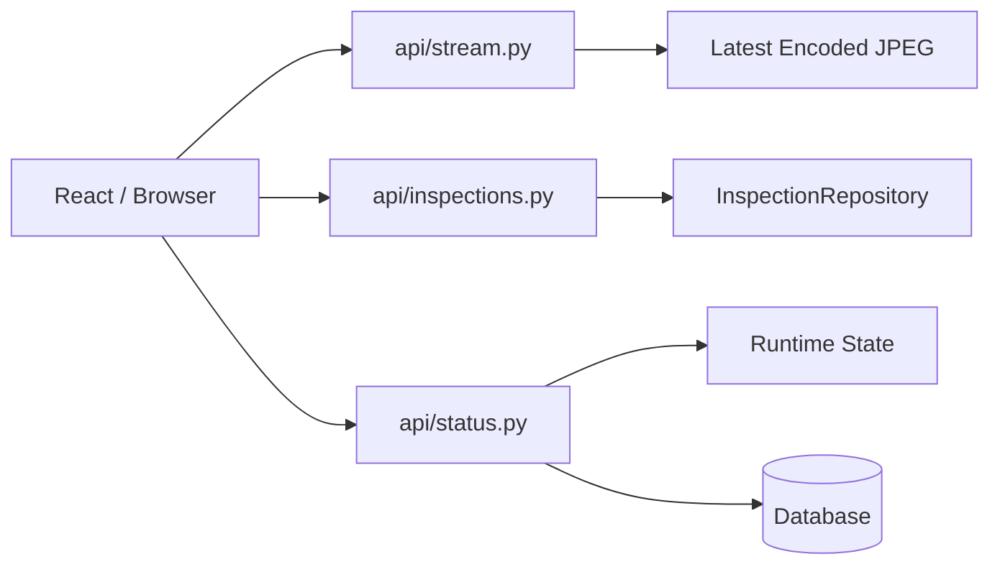

### `camera/`

운영체제에 등록된 USB/UVC 또는 DroidCam 가상 카메라를 단 한 번 열고 최신 raw frame을 공유한다.

| 파일 | 역할 |
| --- | --- |
| `capture.py` | `cv2.VideoCapture` 생성, 프레임 수집, 재연결, release |
| `frame_buffer.py` | thread-safe latest-value/latest-frame 버퍼와 version 관리 |
| `__init__.py` | camera public API 노출 |

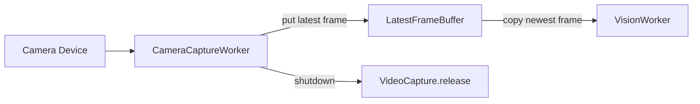

버퍼는 queue가 아니다. 새 프레임이 들어오면 이전 프레임을 교체하므로 inference가 느려도 오래된 프레임이 누적되지 않는다.

### `vision/`

Mask R-CNN 모델 로딩부터 프레임 추론, instance 정규화, 시각화, JPEG 생성까지 영상 처리의 중심 책임을 담당한다.

| 파일 | 역할 |
| --- | --- |
| `contracts.py` | `DetectedInstance`, `FrameVisionResult`, `InspectionResult`, processor protocol |
| `mask_rcnn_predictor.py` | Mask R-CNN architecture 재구성, state dict 로드, inference |
| `yolo26_predictor.py` | Ultralytics YOLO26 best.pt 로드, device 선택, inference |
| `yolo26_postprocessor.py` | YOLO Results를 공통 `DetectedInstance`로 변환 |
| `yolo26_processor.py` | YOLO predictor/postprocessor/visualizer orchestration |
| `postprocessor.py` | score filtering, binary mask, contour, center, area 계산 |
| `visualizer.py` | mask overlay, contour, box, label, inference 정보 표시 |
| `processor.py` | predictor/postprocessor/visualizer orchestration, Mock fallback |
| `worker.py` | 최신 raw frame 처리, JPEG 인코딩, 공유 버퍼 갱신 |
| `__init__.py` | 순환 import를 피하는 public contract 노출 |

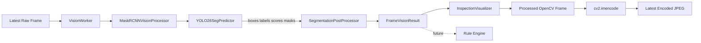

색상은 OpenCV BGR 기준으로 `visualizer.py` 한 곳에서 관리한다.

- Bolt: 파란색 `(255, 0, 0)`
- Thread/Nut: 파란색 `(255, 0, 0)`
- Washer: 노란색 `(0, 255, 255)`

### `streaming/`

Vision Worker가 이미 인코딩한 최신 JPEG byte를 multipart MJPEG 형식으로 전송한다.

| 파일 | 역할 |
| --- | --- |
| `mjpeg.py` | multipart boundary/header 생성과 stream FPS 제한 |
| `__init__.py` | generator와 boundary 노출 |

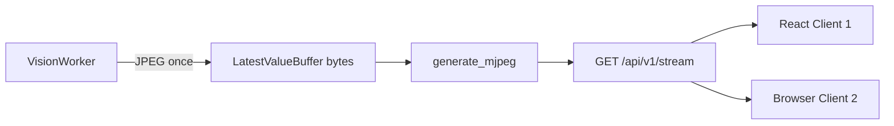

client가 증가해도 카메라, inference, JPEG encoding은 반복되지 않는다. 각 client는 공유된 최신 JPEG를 읽기만 한다.

### `inspection/`

한 프레임의 판정과 DB에 저장할 하나의 검사 이벤트를 분리한다.

| 파일 | 역할 |
| --- | --- |
| `event_manager.py` | 연속 defect 확인, 중복 저장 억제, normal 복귀 상태머신 |
| `service.py` | 확정 이벤트의 증거 이미지 저장과 ORM entity 생성 |
| `__init__.py` | inspection public API 노출 |

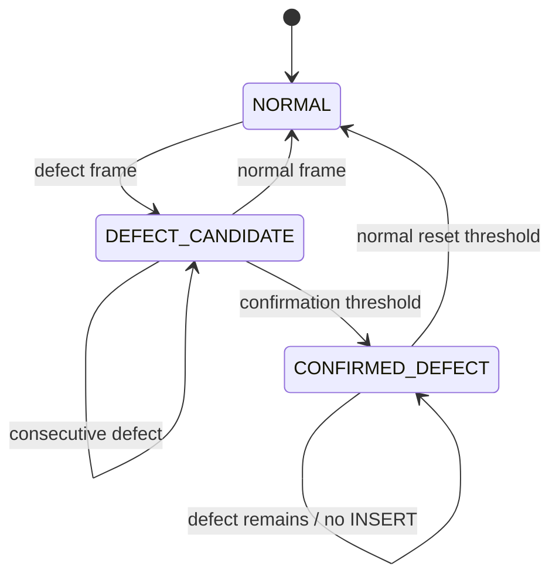

현재 Mask R-CNN은 instance segmentation만 수행하며 실제 불량 판정은 하지 않는다. 미래 Rule Engine이 `InspectionResult`를 만들면 Event Manager가 저장 시점을 결정한다.

### `models/`

DB 테이블의 구조와 JSON 응답 변환을 정의한다.

| 파일 | 역할 |
| --- | --- |
| `inspection.py` | `inspections` ORM model과 `to_dict()` |
| `__init__.py` | model metadata 등록 및 public export |

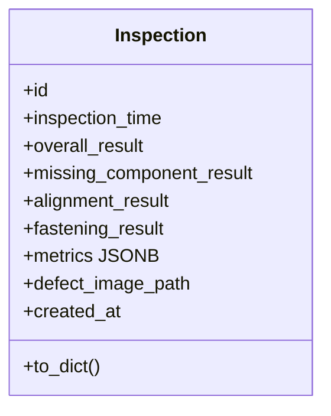

### `repositories/`

SQLAlchemy query와 transaction 경계를 캡슐화한다. API와 service가 SQLAlchemy query를 직접 반복하지 않도록 한다.

| 파일 | 역할 |
| --- | --- |
| `inspection_repository.py` | add, latest, get, pagination query |
| `__init__.py` | repository public export |

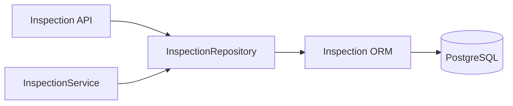

### `database/`

Flask application과 SQLAlchemy를 연결하는 공통 DB 객체를 제공한다.

| 파일 | 역할 |
| --- | --- |
| `db.py` | SQLAlchemy instance와 declarative base |
| `__init__.py` | `db` public export |

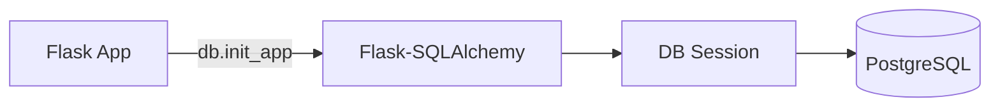

## 루트 파일 역할

### `app/__init__.py`

Flask application factory다. `.env` 로딩, config 적용, SQLAlchemy 초기화, Blueprint 등록, Runtime 설치와 공통 오류 handler 등록을 담당한다.

### `config.py`

환경변수를 typed 설정값으로 변환한다. 카메라, FPS, JPEG, 모델 경로, CUDA/CPU, threshold, DB, Event Manager 설정을 한 곳에서 관리한다.

### `lifecycle.py`

장기 실행 객체의 composition root다. buffer, camera worker, Mask R-CNN processor, Vision Worker, Event Manager를 한 번 생성하고 시작·종료 순서를 관리한다.

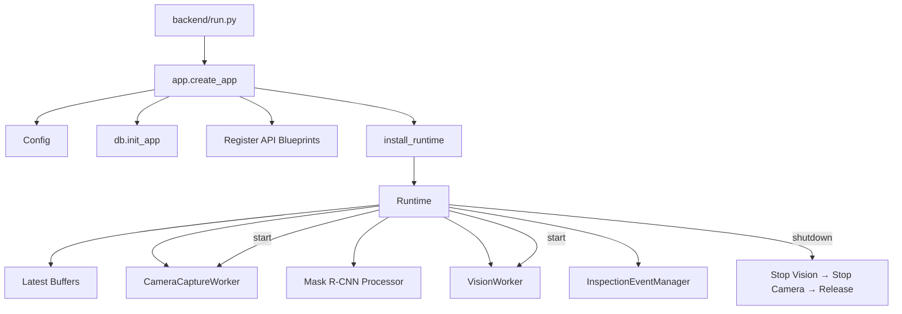

## 전체 의존 방향

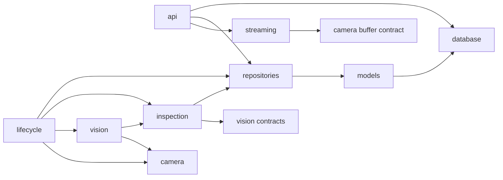

`vision/__init__.py`에서 `VisionWorker`를 re-export하지 않는 이유는 `VisionWorker → InspectionEventManager → vision contracts` 관계에서 package import 순환을 만들지 않기 위해서다. Worker는 필요한 위치에서 `app.vision.worker`로 직접 import한다.

## 영상 경로와 데이터 경로

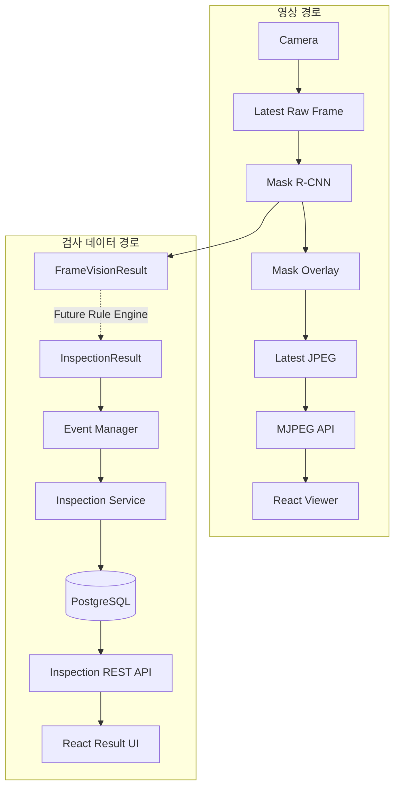

영상 전송 경로는 DB 상태와 독립적이다. PostgreSQL 연결이 일시적으로 실패하더라도 카메라와 MJPEG stream 자체는 계속 동작할 수 있다.
