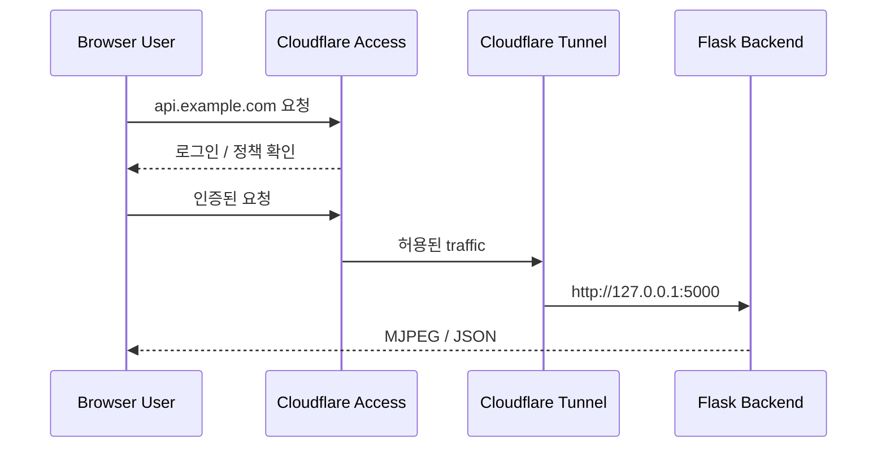

# Cloudflare Tunnel로 Vision Backend 공개하기

## 목적

카메라와 CUDA GPU는 Windows 호스트에서 직접 사용해야 하므로 Flask 백엔드를 Cloudflare Workers로 옮기지 않는다. 대신 `cloudflared`가 로컬 `http://127.0.0.1:5000`으로 연결되는 outbound tunnel을 만들고 Cloudflare가 외부 HTTPS 주소를 제공한다.

```mermaid
flowchart LR
    CAMERA[USB / DroidCam Camera] --> FLASK[Windows Flask Backend\n127.0.0.1:5000]
    GPU[CUDA GPU] --> FLASK
    FLASK --> TUNNEL[cloudflared\nOutbound Tunnel]
    TUNNEL --> EDGE[Cloudflare Edge HTTPS]
    EDGE --> REACT[Remote React / Browser]

    FLASK --> HEALTH[/api/v1/health]
    FLASK --> STREAM[/api/v1/stream]
    FLASK --> REST[/api/v1/inspections]
```

라우터 port forwarding이나 공인 IP 공개는 필요하지 않다. 카메라, 모델, Vision Worker는 기존처럼 로컬에서 한 번만 실행된다.

## 준비

PowerShell에서 `cloudflared`를 설치한다.

```powershell
winget install --id Cloudflare.cloudflared
cloudflared --version
```

백엔드 패키지를 설치한다.

```powershell
cd C:\sungwon\vision_final_project
.\.venv\Scripts\python -m pip install -r backend\requirements.txt
```

## 방법 1: Quick Tunnel

계정이나 도메인 없이 임시 HTTPS 주소로 확인하는 개발용 방식이다. URL은 실행할 때마다 바뀌며 운영 용도로 사용하지 않는다.

### 1. 백엔드 실행

`backend/.env`에서 origin을 로컬 호스트에만 bind하는 것을 권장한다.

```dotenv
FLASK_HOST=127.0.0.1
FLASK_PORT=5000
CORS_ALLOWED_ORIGINS=http://localhost:5173
```

백엔드를 실행한다.

```powershell
.\.venv\Scripts\python backend\run.py
```

다음 주소가 정상인지 확인한다.

```powershell
Invoke-RestMethod http://127.0.0.1:5000/api/v1/health
```

예상 응답:

```json
{
  "status": "ok",
  "service": "vision-backend",
  "modelLoaded": true,
  "modelType": "yolo26-seg"
}
```

### 2. Quick Tunnel 실행

새 PowerShell에서 다음 스크립트를 실행한다.

```powershell
.\scripts\start_cloudflare_tunnel.ps1 -Mode Quick
```

스크립트는 먼저 `/api/v1/health`를 확인한 뒤 다음과 동일한 명령을 실행한다.

```powershell
cloudflared tunnel --url http://127.0.0.1:5000
```

터미널에 다음과 같은 임시 URL이 출력된다.

```text
https://random-words.trycloudflare.com
```

확인 주소:

```text
https://random-words.trycloudflare.com/api/v1/health
https://random-words.trycloudflare.com/stream-test
https://random-words.trycloudflare.com/api/v1/stream
```

사용자 홈의 `.cloudflared/config.yml` 또는 `config.yaml`이 존재하면 Quick Tunnel이 지원되지 않을 수 있다. 이 경우 Named Tunnel을 사용하거나 해당 설정 파일을 안전하게 별도 보관한 뒤 Quick Tunnel을 실행한다.

### 3. React에서 임시 URL 사용

`frontend/.env.local`에 출력된 주소를 설정한다.

```dotenv
VITE_API_BASE_URL=https://random-words.trycloudflare.com
```

React 개발 서버를 다시 실행한다.

```powershell
cd frontend
npm run dev
```

`` 기반 MJPEG는 URL을 직접 사용할 수 있다. `fetch` REST 요청은 브라우저 CORS 검사를 받으므로 `backend/.env`의 `CORS_ALLOWED_ORIGINS`에는 React가 실제로 열린 origin을 넣어야 한다. 예를 들어 React가 로컬 `5173`에서 실행되면 backend tunnel URL이 아니라 `http://localhost:5173`을 허용한다.

## 방법 2: 고정 도메인의 Named Tunnel

고정된 `api.example.com` 주소를 사용하려면 Cloudflare에 등록된 도메인이 필요하다.

### 1. Cloudflare 인증

```powershell
cloudflared tunnel login
```

브라우저에서 Cloudflare 계정과 대상 domain zone을 승인한다.

### 2. Tunnel 생성

```powershell
cloudflared tunnel create vision-backend
cloudflared tunnel list
```

출력되는 Tunnel UUID와 credentials JSON 위치를 기록한다.

### 3. 설정 파일 생성

저장소의 template을 복사한다.

```powershell
Copy-Item cloudflare\config.yml.example cloudflare\config.yml
```

`cloudflare/config.yml`을 실제 값으로 수정한다.

```yaml
tunnel: 11111111-2222-3333-4444-555555555555
credentials-file: C:/Users/YOUR_USER/.cloudflared/11111111-2222-3333-4444-555555555555.json

ingress:
  - hostname: api.example.com
    service: http://127.0.0.1:5000
    originRequest:
      connectTimeout: 10s
  - service: http_status:404
```

실제 `config.yml`과 credentials JSON은 Git에 커밋하지 않는다. `.gitignore`에 제외 규칙이 포함되어 있다.

### 4. DNS route 생성

```powershell
cloudflared tunnel route dns vision-backend api.example.com
```

### 5. Named Tunnel 실행

```powershell
.\scripts\start_cloudflare_tunnel.ps1 `
  -Mode Named `
  -TunnelName vision-backend `
  -ConfigPath cloudflare/config.yml
```

직접 실행하려면:

```powershell
cloudflared tunnel --config cloudflare/config.yml run vision-backend
```

### 6. Backend와 React 환경설정

Backend:

```dotenv
FLASK_HOST=127.0.0.1
CORS_ALLOWED_ORIGINS=https://vision.example.com,http://localhost:5173
```

React:

```dotenv
VITE_API_BASE_URL=https://api.example.com
```

환경변수를 변경한 뒤 Flask와 Vite를 모두 재시작한다.

## Cloudflare Access 적용

현재 API에는 자체 사용자 인증이 없다. Tunnel public hostname만 만들면 URL을 아는 인터넷 사용자가 카메라 영상과 검사 API에 접근할 수 있다. 운영 또는 외부 시연 환경에서는 Cloudflare Zero Trust의 Access application을 먼저 생성하고 허용할 사용자 이메일 또는 IdP policy를 설정한다.

권장 흐름:



MJPEG ``는 임의의 Authorization header를 붙이기 어렵다. Access를 사용하는 브라우저에서는 먼저 `https://api.example.com/stream-test` 등을 열어 Access 로그인을 완료하고 session cookie가 생성된 상태에서 React Viewer를 사용한다. 가능하면 React와 API를 같은 상위 domain 아래에 배치한다.

## MJPEG 관련 설정

- `/api/v1/stream`은 `Cache-Control: no-store`를 반환한다.
- Cloudflare Cache Rule을 별도로 만든 경우 `/api/v1/stream*`은 bypass 대상으로 설정한다.
- Tunnel client 수가 늘어도 YOLO inference와 JPEG encoding은 backend worker에서 한 번만 수행된다.
- 외부 network bandwidth를 줄이려면 `STREAM_FPS`, `JPEG_QUALITY`, 카메라 해상도를 낮춘다.

예시:

```dotenv
CAMERA_WIDTH=1280
CAMERA_HEIGHT=720
VISION_FPS=10
STREAM_FPS=8
JPEG_QUALITY=75
```

## 문제 해결

### Backend health 확인 실패

```powershell
Invoke-RestMethod http://127.0.0.1:5000/api/v1/health
```

- Flask가 실행 중인지 확인한다.
- `FLASK_PORT`와 script의 `-Origin`이 같은지 확인한다.
- 모델 로딩 실패는 `/api/v1/system/status`의 `modelError`에서 확인한다.

### 502 Bad Gateway

Cloudflare에는 연결되었지만 `cloudflared`가 Flask에 연결하지 못한 상태다.

- Flask 주소가 `127.0.0.1:5000`인지 확인한다.
- `cloudflare/config.yml`의 `service`를 확인한다.
- Flask와 cloudflared가 동일한 Windows host에서 실행되는지 확인한다.

### React에서는 영상이 나오지 않음

- `VITE_API_BASE_URL` 변경 후 Vite를 재시작한다.
- tunnel URL의 `/stream-test`를 먼저 직접 확인한다.
- Cloudflare Access를 사용한다면 API hostname에서 로그인을 완료한다.
- browser 개발자 도구에서 302, 403, 502 응답을 확인한다.

### Quick Tunnel이 시작되지 않음

사용자 홈의 `.cloudflared/config.yml` 또는 `config.yaml` 존재 여부를 확인한다. Quick Tunnel은 개발 확인용이며 Named Tunnel 설정과 함께 사용할 때 제약이 있다.

## 종료

Tunnel terminal에서 `Ctrl+C`를 누르면 외부 HTTPS route가 중단된다. Flask도 별도 terminal에서 `Ctrl+C`로 종료한다. Named Tunnel의 DNS record나 tunnel 자체는 명시적으로 삭제하기 전까지 Cloudflare 계정에 남아 있다.
