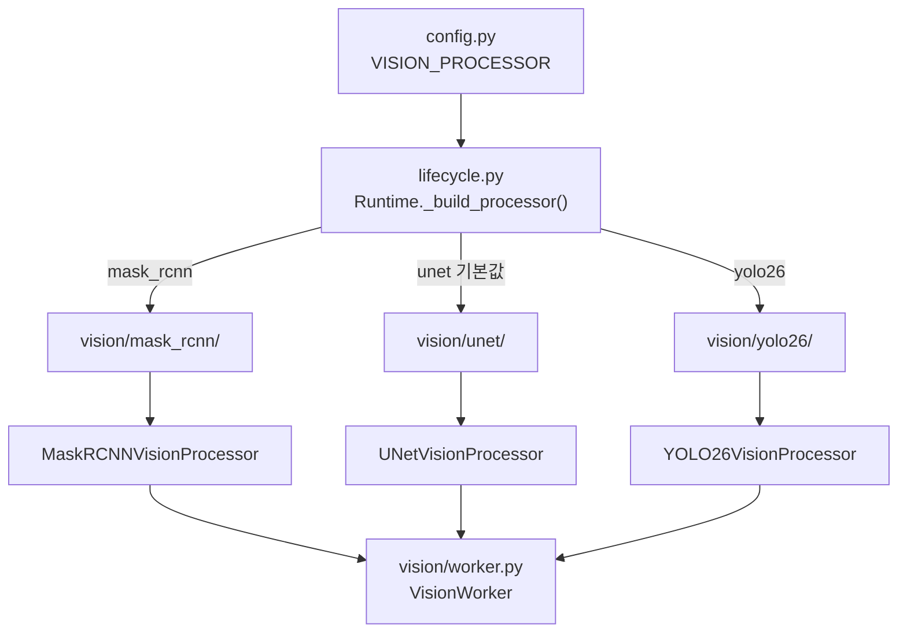
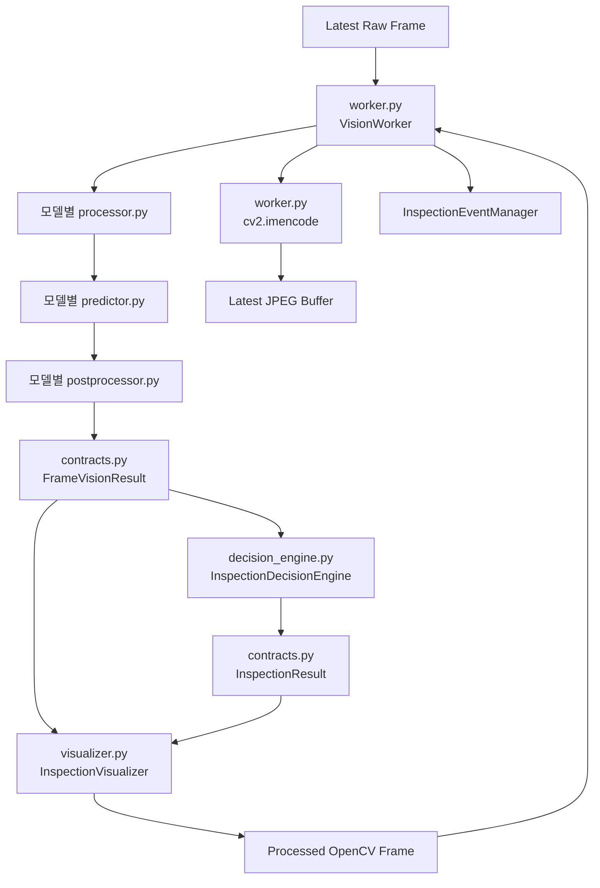
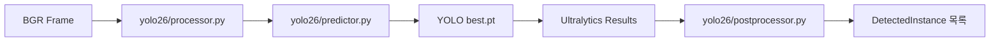
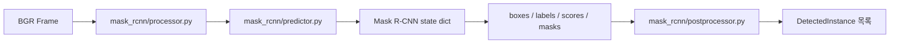

# Vision Package Flow

`backend/app/vision`은 모델에 독립적인 공통 처리와 모델별 구현을 분리한다.

## 폴더 구조

```text
vision/
├── __init__.py
├── contracts.py
├── decision_engine.py
├── visualizer.py
├── worker.py
├── mask_rcnn/
│   ├── __init__.py
│   ├── predictor.py
│   ├── postprocessor.py
│   └── processor.py
├── unet/
│   ├── __init__.py
│   ├── predictor.py
│   ├── postprocessor.py
│   └── processor.py
└── yolo26/
    ├── __init__.py
    ├── predictor.py
    ├── postprocessor.py
    └── processor.py
```

## 파일별 책임

| 파일 | 책임 |
| --- | --- |
| `vision/__init__.py` | 공통 contract와 각 모델 processor를 외부에 노출 |
| `contracts.py` | `DetectedInstance`, `FrameVisionResult`, `InspectionResult`, `VisionProcessor` 정의 |
| `decision_engine.py` | 모델 공통 조립 순서·체결 상태 판정과 DB 저장용 compact metadata 생성 |
| `visualizer.py` | mask, contour, bbox, confidence, 추론 시간과 판정 결과 overlay |
| `worker.py` | 최신 raw frame 처리, JPEG 인코딩, latest buffer 갱신, EventManager 전달 |
| `mask_rcnn/predictor.py` | Mask R-CNN state dict 로드와 inference |
| `mask_rcnn/postprocessor.py` | boxes, labels, scores, masks를 공통 instance로 변환 |
| `mask_rcnn/processor.py` | Mask R-CNN predictor → postprocessor → decision → visualizer 조립 |
| `unet/predictor.py` | locator/fine U-Net checkpoint 로드, ROI와 semantic class map 생성 |
| `unet/postprocessor.py` | semantic class map을 connected component instance로 변환 |
| `unet/processor.py` | U-Net predictor → postprocessor → decision → visualizer 조립 |
| `yolo26/predictor.py` | Ultralytics YOLO segmentation checkpoint 로드와 inference |
| `yolo26/postprocessor.py` | Ultralytics Results를 공통 instance로 변환 |
| `yolo26/processor.py` | YOLO predictor → postprocessor → decision → visualizer 조립 |
| 각 모델의 `__init__.py` | 해당 모델 package의 public class를 한 곳에서 노출 |

## Runtime 모델 선택



모델은 `Runtime` 생성 시 한 번 로드된다. `/api/v1/stream` 요청이나 브라우저 수에 따라 다시 생성되지 않는다.

## 모델 공통 처리 흐름



## U-Net 세부 흐름

```mermaid
flowchart LR
    Frame["BGR Frame"]
    Predictor["unet/predictor.py"]
    Locator["locator/best.pt"]
    ROI["Foreground ROI"]
    Fine["fine/best.pt"]
    Semantic["Class Map + Probabilities"]
    Post["unet/postprocessor.py"]
    Instances["DetectedInstance 목록"]
    Processor["unet/processor.py"]

    Frame --> Processor
    Processor --> Predictor
    Predictor --> Locator
    Locator --> ROI
    ROI --> Fine
    Fine --> Semantic
    Semantic --> Post
    Post --> Instances
```



## YOLO26 세부 흐름



## Mask R-CNN 세부 흐름



세 모델은 서로 다른 추론 결과를 만들지만, postprocessor 이후에는 모두 `DetectedInstance`와 `FrameVisionResult`로 정규화된다. 따라서 `decision_engine.py`, `visualizer.py`, `worker.py`, EventManager와 DB 저장 경로는 모델과 무관하게 동일하게 동작한다.
